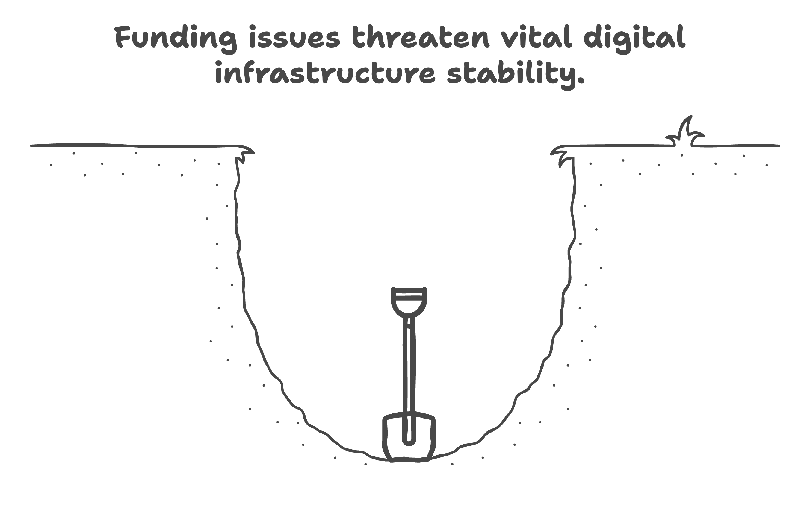
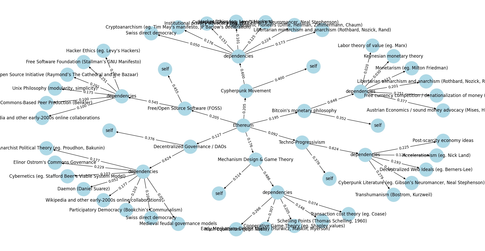
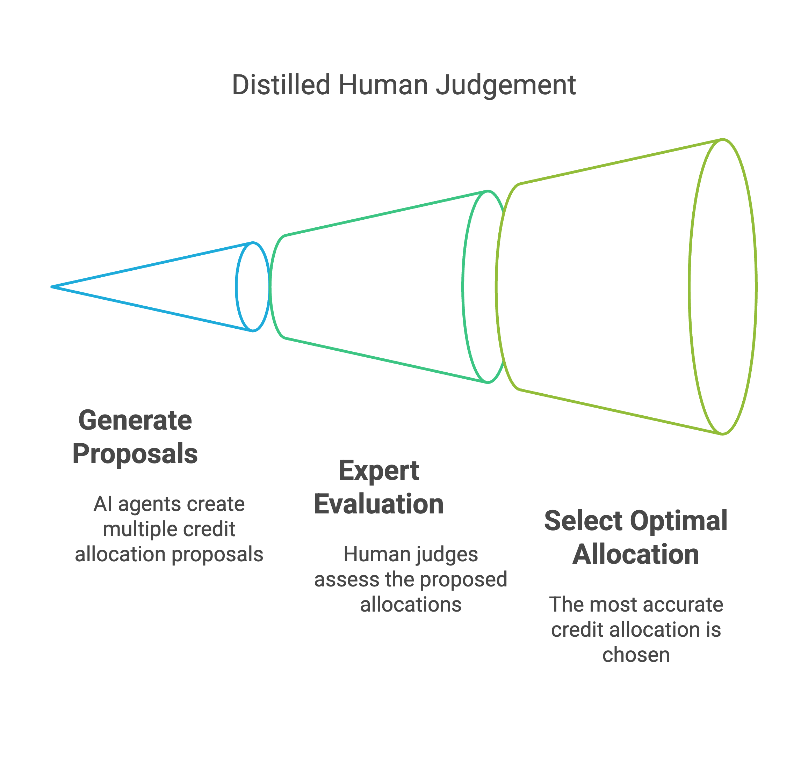
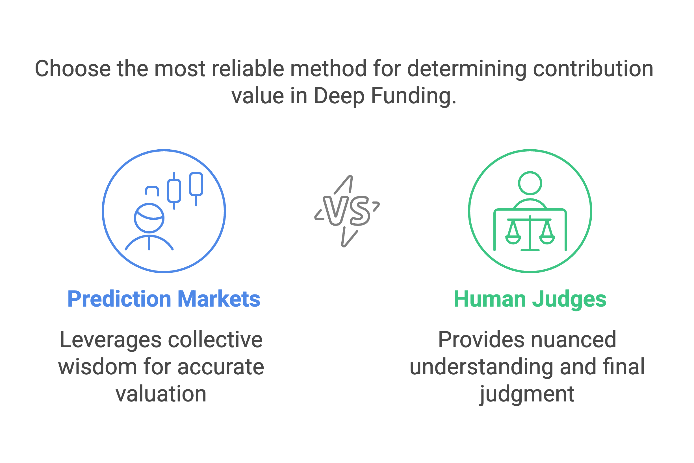

For the past three years, I've been knee-deep in the Solana and broader blockchain ecosystem, with much of that time spent alongside Joey Meere tackling what might be the most thankless mission out there – public goods funding. Joey built the first open-source quadratic funding platform called Stockpile, and I was fortunate enough to join this journey until early last year when we had to close up shop. Throughout this time, I've watched countless approaches to funding public goods come and go – from traditional crowdfunding to quadratic funding and now, to what might be a game-changer: Deep Funding.

Vitalik Buterin introduced "Deep Funding" in his blog posts late last year, and his latest article expands on both the philosophy and practical implementation. Today, I want to break down this mechanism and explore why it might be exactly what we need for sustainable public goods and open-source funding on Solana.

## The Broken Economics of Public Goods

Let's face it – funding for public goods and open-source projects is fundamentally broken. This isn't just a Solana problem or even a blockchain problem; it's an economic reality that spans our entire digital world.

Take core-js, for instance. This JavaScript library powers tech giants like Apple, Netflix, and Spotify. It's baked into software that generates billions in revenue, yet its core maintainer earns a pitiful $400 monthly from individual donations. Crazy, right? Our digital infrastructure stands on the shoulders of people who are barely compensated, if at all. Eventually, this leads to critical infrastructure becoming vulnerable or abandoned altogether.

Current funding mechanisms have clear shortcomings. Quadratic funding and retroactive public goods funding tend to reward visible, marketable projects while overlooking less flashy but equally crucial contributors. Think about the cryptographic hash functions and foundational libraries that make blockchain trading possible – these rarely receive the rewards they deserve despite enabling massive value creation.

The problem gets worse when funding gets trapped in silos. People naturally fund what they directly use or see, creating blind spots where less visible contributors go unnoticed. When humans try to track every contribution in vast ecosystems like open-source software with millions of repositories and dependencies, we quickly hit our cognitive limits. 

## What Makes Deep Funding Different?

Deep Funding applies what Vitalik calls "Distilled Human Judgment" (DHJ) to credit attribution. Rather than just funding a project directly, it aims to fund the entire chain of contributors that made it possible.

When you have an open-source project that builds on others' work – like package dependencies – Deep Funding uses DHJ to determine how much credit flows to each contributor. This creates a dependency graph that maps out all the relationships.

The graph Vitalik shared uses Ethereum as an example, showing all the factors and contributors that led to its creation. When funding is allocated, it flows through this graph according to the credit assigned to each node.

Getting people on this graph paid is certainly an implementation challenge, but that's a practical issue that platforms can solve in various ways.

## Distilled Human Judgment: AI with Human Oversight

"Distilled Human Judgment" involves creating a network of AI agents dedicated to credit allocation. Using multiple AIs instead of just one prevents single points of failure or manipulation.

Each AI agent proposes credit allocations for the graph, generating a dataset of possible distributions. Then comes the crucial step – a "spot check" where expert judges evaluate which credit allocation seems most accurate.

This approach incentivizes the AI to align with human values while maintaining computational fairness. It's a clever balance of machine scale with human wisdom.

## Could Futarchy Play a Role?

Futarchy – a governance model first proposed by economist Robin Hanson and implemented on Solana by MetaDAO – uses prediction markets to determine outcomes rather than traditional voting (see https://futarchy.guide).

This could be integrated into Deep Funding through jury decision markets that act as the spot check, potentially reducing or eliminating the need for human juries. Markets could predict "How much value does Y contribute to X?" with participants buying and selling shares based on their predictions about how human judges would answer.

During trading, prices would converge toward collective wisdom (say, 23% contribution value). After trading ends, judges would review both the market's allocation and AI systems' recommendations before making their determination (perhaps 19%). This final judgment would resolve the markets – those who bet closer to 19% would receive payouts while those further away would lose stakes proportionally.

## Addressing Key Problems in Public Goods Funding

Deep Funding tackles several major issues with current funding approaches:

- It helps unrecognized contributors get rewarded by tracking value through dependency chains
- It breaks out of funding silos by recognizing previously invisible contributions
- It scales to match modern software ecosystems by using AI for bulk processing
- It directs resources more accurately to where value is created
- The dependency graph approach could potentially extend beyond software into areas like academic research, creative arts, and entrepreneurship

## The Devil in the Details
As with any public goods funding mechanism, implementation makes or breaks it. Some challenges include:

- Creating a credibly neutral jury system for spot checks
- Finding ways to credit contributors who might be unreachable
- Addressing scalability issues
- Preventing gaming of the system
- Ensuring unbiased AI inference

Implementing this on Solana brings additional challenges: balancing on-chain and off-chain operations, storing the graph state on-chain, ensuring data availability, managing operational costs, handling transaction complexities, and navigating the futarchic system.

What's more, the Solana ecosystem hasn't exactly been known for robust open-source and public goods support. However, I'm hopeful that someone will pick up where Stockpile and Cubik left off a year ago and breathe life into the OSS and public goods funding ecosystem on Solana by implementing this innovative mechanism.

Here's to more power for decentralization – and fair compensation for those building its foundations.          