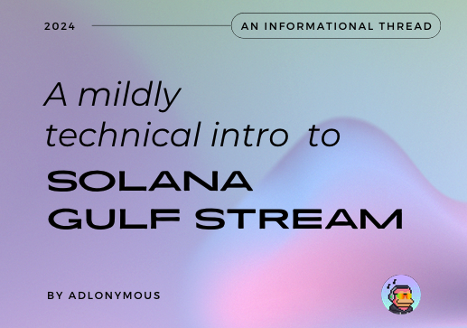
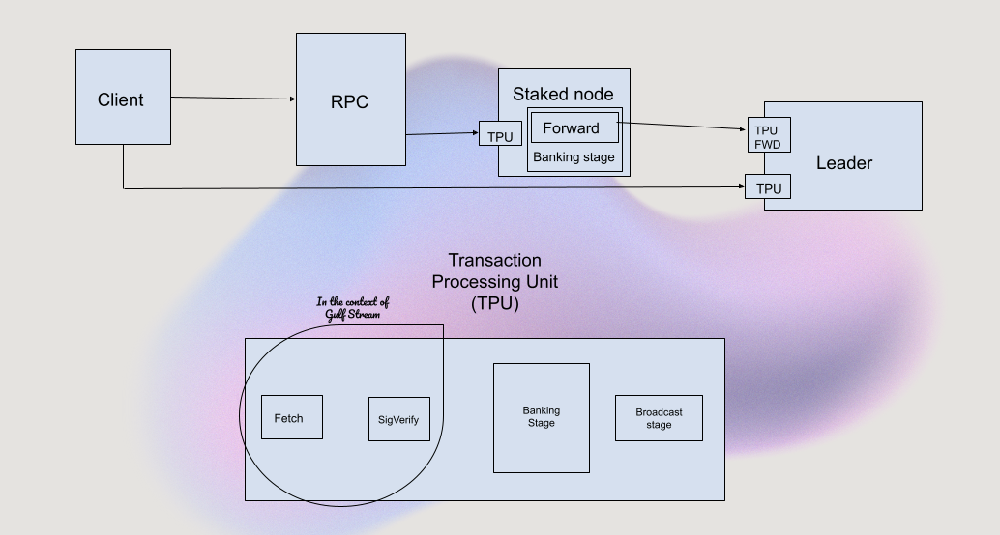

## Introduction

Welcome to Inside Solana — a no-fluff series where I dive into core Solana topics in an easily digestible way. The topic for Edition #1 is ‘Gulf Stream.’

## Understanding Gulf Stream

Solana presents a significant advancement in blockchain technology, continuously tackling critical challenges associated with transaction throughput, latency and network congestion. One of the 8 key innovations of Solana that gives it a clear operational and technical advantage over many other blockchain networks is Gulf Stream. **Gulf Stream** is the protocol used to handle **unconfirmed** transactions that have been broadcast to the Solana network, but have not been included in a block yet.

## Earlier Landscape

To understand why Gulf Stream represents a significant advance over traditional methods to manage unconfirmed transactions in Bitcoin & Ethereum, we need to look at how they manage it. Most blockchains use what is commonly known as **mempool** (short for memory pool) as a temporary storage area where pending transactions await confirmation and inclusion in a block.

### Bitcoin Mempool

In Bitcoin, when a transaction is broadcast to the network, it first gets verified by all the nodes available. After being successfully verified by a node, it sits inside the node’s **mempool** (think of it as a virtual pool) until a miner picks it up and includes it in the next block.

This sounds good in theory, but what happens when there is an extremely high demand for transactions to be included in each block? There would be a **backlog of unconfirmed transactions**, which would keep growing until the mempool can’t hold any more transactions. Then, **transactions get dropped from the mempool**. And for the transactions that remain in the mempool, there is insane competition to get in the block.

To solve this, once the mempool reaches full capacity, the nodes start prioritizing transactions by setting up a **minimal transaction fee threshold**. Transactions with gas fees lower than the threshold get dropped from the mempool and only new transactions with a large enough fee are allowed access to the mempool. And as competition to get your transaction in the block increases, the threshold increases and users have to pay prohibitively **high transaction fees**. To add on to the pain, the Bitcoin **block size is static** and relatively low (1 MB). This means the transactions with the highest fees get included in the block and the others have to wait, leading to **long confirmation times** — often in double-digit minutes.

### Ethereum Mempool

Mempool on Ethereum is called **‘transaction queue’** or **‘txpool’** depending on the client, and confirming transactions work pretty much the same. The node verifies the transaction, adds it to mempool, validators try to add it to the block and the block is broadcast across the network. As the nodes see the included transaction in the block, they remove it from mempool. It differs from Bitcoin in the way that Bitcoin blocks have a size limit for transactions to get included in it, while Ethereum blocks have a **gas limit** which refers to the amount of computational work that can be done per block (more complex smart contracts require more computation). The fee on each transaction is positively correlated to the amount of computation required. This model gave it a technical advantage over Bitcoin, but as the traffic on Ethereum increased, it was increasingly apparent that there must be a better solution. And the solution was not simply increasing the number of transactions in each block, as this would make it increasingly expensive to run a full node.

### MEV Activity

Another side-effect of the mempool is **MEV activity**. MEV stands for Maximum Extractable Value and refers to any value derived from adding, removing or reordering transactions within a given block. Since each miner has the power to choose transactions they include in a block, they favor those that benefit them the most in the order that benefit them the most. Some examples of MEV are DEX arbitrage, Liquidation opportunites from flash loans, frontrunning and sandwich attacks. Sandwich attacks involve placing orders before and after a large trade to profit from the price shift that the large trade can induce.

## How Solana Solves This

Solana’s architecture is a very different to it’s predecessors — Bitcoin & Ethereum. Since Solana predetermines it’s leader schedule in advance for a defined number of slots (each slot lasts 400ms and a block may or may not be created for that slot). This allows transaction forwarding to the upcoming leaders if the current leader has more blocks than it can handle, thus highly streamlining block production.

Let’s take a look at how Gulf Stream changes the lifecycle of a transaction before it passes it onto the Solana runtime — Sealevel.

A transaction is created by a client which could be a wallet, an application or a program. All transactions are sent to a RPC node (which serves as an intermediary between the users and the validator nodes) through the JSON RPC API. There is an important distinction between RPCs on Solana & Ethereum. An RPC is a node that is used to access on-chain data in a readable format. On Ethereum, all RPC nodes are validator nodes as well. But on Solana, most RPCs are Non-Voting validators which mean their main purpose is to access on-chain data. Then the RPC node establishes a QUIC connection to a leader node’s TPU which executes these transactions and add them to the current block or in line for the next few blocks

Let’s go over what QUIC and TPU are.

QUIC stands for Quick UDP Internet Connections and is a modern transport layer protocol for sending data through packets between devices on the same network. It allows quick delivery of data packets like UDP coupled with integration of cryptographic key exchange and protocol details into an initial handshake similar to TCP.

TPU stands for Transaction Processing Unit and it handles and executes transactions through several distinct stages. It ensures transactions are validated, executed and propagated across the network. The first stage is the Fetch stage which receives incoming transactions from clients and batches it into groups of 128 packets. The next stage is the SigVerify stage which receives the packets from the fetch stages and verifies the signature of the transaction, handles de-duplication and passed on to the next stage called the Banking stage from where the Solana runtime — Sealevel starts. The Banking stage is connected to the Bank which contains details about the cluster and other information required for making blocks. The Banking stage also consists of a Scheduler and Execution zone which is multi-threaded (the whole parallel processing shebang). The stage after this — the Broadcast stage is the last stage of the TPU.

But with the introduction of SWQoS, if a staked node is available to the RPC, the transaction can be sent to the staked node which has it’s own TPU which processes transactions and send it to the Leader’s TPU forward port through the Scheduler before it can reach the Execution part of the Banking stage and subsequent Broadcast, and the Leader includes it in the blocks it makes. But sometimes, if the staked node has an upcoming Leader slot available, it may hold on to the block and execute it and include it in the blocks it makes. Each leader allows two types of connections through QUIC — 500 open connections for any RPC node and 2000 stake weighted connections only for staked validators.

### Gulf Stream flow into Sealevel

- User creates a transaction

- The transaction is submitted to an RPC Node

- If the RPC doesn’t have a staked node, the transaction establishes a QUIC connection to the leader and sends the transaction into it’s TPU from where it goes into the Sealevel runtime and is executed and broadcast

- If the RPC has a staked node, the transaction goes through the TPU of the staked node and is forwarded from the Scheduler of it’s TPU to the leader’s TPU forward port and executed and broadcast.

This entire process is called Gulf Stream and it allows Solana to be the cheap and fast chain that everyone knows it to be. It eliminates the need for a traditional mempool leveraging the above described processes to advance transaction caching to the network’s edge.

We looked at what MEV and Sandwich attacks were earlier in this article and how a public mempool enables it. But does the absence of a public mempool on Solana mean no MEV? Well, no as there are several methods that let validators in finding MEV opportunities. For more on it, check out Helius’ MEV Article: https://www.helius.dev/blog/solana-mev-an-introduction

## Conclusion

Gulf Stream allows Solana to be recognized as a cheap and fast blockchain network by eliminating traditional bottlenecks found in other blockchain systems. While it reduces MEV opportunities due to no public mempool, some methods still exist for validators to find MEV opportunities.

## Important Resources

- [Stake Weighted Quality of Service](https://www.helius.dev/blog/stake-weighted-quality-of-service-everything-you-need-to-know#the-lifecycle-of-a-transaction-with-swqos)
- [All You Need to Know About Solana and QUIC](https://www.helius.dev/blog/all-you-need-to-know-about-solana-and-quic)

