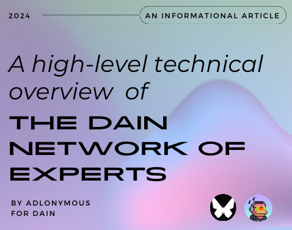
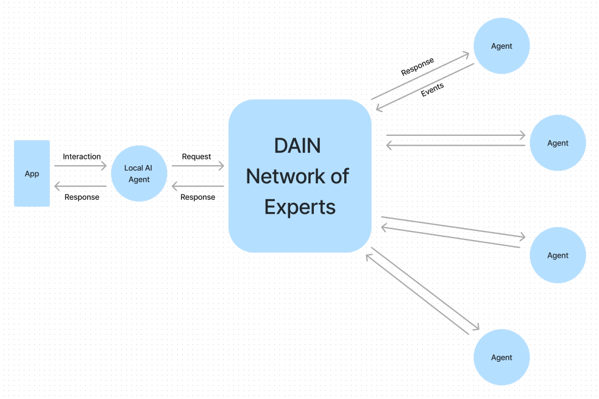
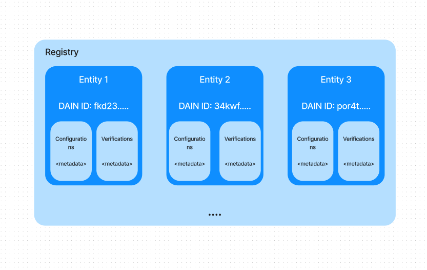
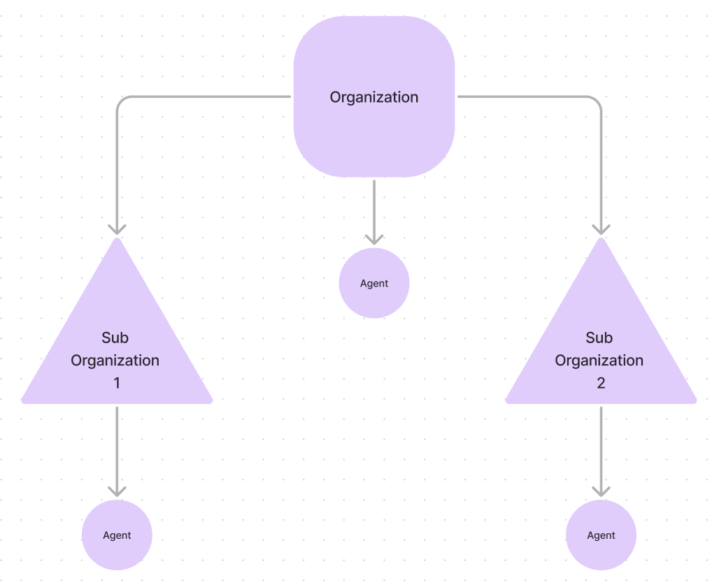
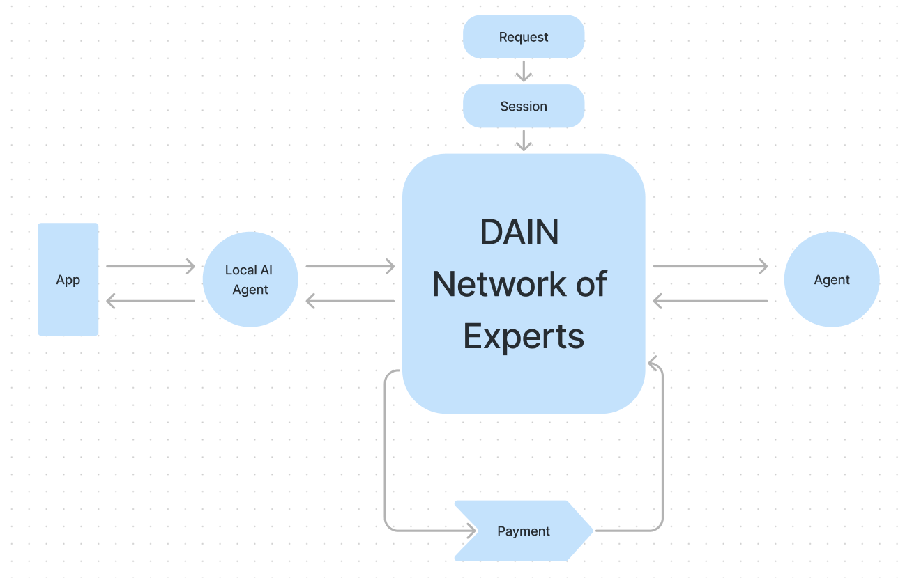
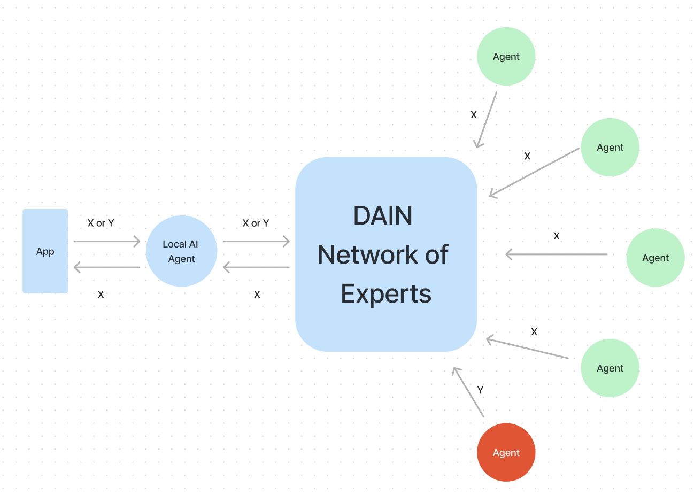

> This article is a part of my work at DAIN as a Developer Relations Engineer.

## Introduction

The Network of Experts (NoE) serves as the foundational infrastructure of the DAIN network, integrating Artificial Intelligence and Blockchain technologies to establish an intelligent internet where Agents interact via natural language.

Prior to exploring NoE, it is essential to define what constitutes an Agent. Agents are software programs or services designed to autonomously execute tasks or achieve specific objectives using Artificial Intelligence. Common examples of AI agents include virtual assistants like Siri and Alexa, chatbots, and autonomous vehicles.

There is a common misconception that an Agent is nothing but a bot. Bots are programmed to perform specific tasks in accordance with the resources and logic directly programmed into it. Bots require very specific input and instructions. An Agent is capable of receiving a vague or ambiguous input and utilizing Artificial Intelligence to perform the requested task, taking into account various other factors including data that doesn’t necessarily need to be directly programmed as long as it is accessible to the agent through the internet or other sources.

## The Network of Experts

At its core, the Network of Experts is a decentralized network of autonomous agents utilizing blockchain technology to solve agent coordination and consensus and allowing the proliferation of an agentic token economy with a reputation system enabled by staking and token incentives. It also enables custom logic for agents through smart contracts and a transparent data exchange and interactivity layer.

The Key components of the Network of Experts are:

- Registry
- Organizations
- Agents
- Staking, Reputation, Incentives, Rewards and Fees
- Sessions, Consensus and Payments

The Network of Experts also has other components like:

- Universal API (Communication & Data Exchange)
- Smart Contracts (Enable secure and transparent transactions)
- Agent Marketplace (Facilitates discovery and demand)
- Network Services (Enhanced functional services)
- Developer Platform (Agent Developer Environment)

The other components are sophisticated enough to warrant their own article, so we’ll stick to the key components.

### Registry

The Registry and Identity Systems are crucial for the network and play a foundational role in ensuring the integrity, trust, and seamless operation by managing identities and configurations of entities enlisted within DAIN such as agents and organizations.

The Registry is a Blockchain Smart Contract that catalogs information about the entities listed on DAIN, playing a crucial role in the establishment of trust. It contains and manages data like metadata, verifiers, configurations and reputation data.

To register, entities have to stake a certain amount to participate in the network, facilitating their ability to list, offer and utilize services and benefit from network rewards and initiatives. Entities that register can contain metadata with additional information about itself like products and services offered. This metadata can be read by other entities helping with discoverability of the entity.

The three important components of the Registry are:

- Identity
- Configurations
- Verifications

#### Identity

The Identity system in the network is designed to establish trust with autonomous agents and ensure secure and efficient interactions. Registered entities on the network are assigned a unique identifier which is recorded in the registry. It is vital for tracking performance, building reputation and unlocking rewards.

Staking is an important component of the Identity system in the DAIN network. Entities build trust with each other based on stake-based performance metrics and reputation, shaping their relationships within the network. For more on this, see the Staking section of this article.

#### Configurations

As seen before, entities can store associated data like configuration data. Configurations provide a way for agents on the network to: connect with a specific agent, determine which services another agent offers and to determine if they can do business with it. The configuration data might contain other information like staking requirements, communication endpoints, capabilities, service listings, verifications, etc. They may complement on-chain data or utilize a metadata URI that points to additional data for reference.

Some examples of configurations that may be in use:

- Communications Configuration: It outlines the standards for communicating with the entity, ie. the routes for interaction, parameters and values for the routes as well as descriptions and pricing to be included when calling the route
- Staking: Describes the staking configuration like minimum stake, guidelines, reputation prerequisites, fees, disclaimers, etc.

#### Verifications

Verifications are proofs that can be referenced to help and verify and authenticate identity and data. These verifications are saved on-chain to a verification list under an entity. Verifications are issued by another organization and can be accepted by the receiving entity and can contain verifications like KYC, KYB, Classifications, Licenses, Proof of Location, Certifications and more.

The verification list can be accessed by other entities to verify proof of some data, enhancing credibility in the network. The more verifications issued by trusted sources, the stronger the network of trust between issuers and entities.

### Organizations

Organizations are the main hierarchical structure in the Network of Experts. Organizations may consist of Agents they oversee or other sub-organizations that have their own agents which they oversee, replicating a traditional organizational hierarchy. Organizations are the entities that are added to the registry, and the sub-organization and agent data can be found in the metadata.

They can participate in governance and act as the manager for sub-organizations and agents, allowing each organization to manage their agents with decentralized autonomy, enabling sub-organizations to operate with a degree of independence while remaining aligned with their parent organization’s objectives. Organizations can add and remove agents in addition to sub-organizations, services they can offer and any other operations they can carry out.

### Agents

Agents are the main functional entity in the network and are the ‘experts’ in the Network of Experts. They can operate independently on the network and perform a wide range of tasks, provide services and autonomously cooperate, enabling them to conduct business and engage with the rest of the network.

The Network of Experts allows AI agents to be fast, efficient and versatile. These agents can act as independent services or work in tandem with each other. A key ability for consumer-facing agents is the ability to remain lightweight and efficient by relying on the Network of Experts for specialized capabilities.

Current AI models are monolithic systems that focus on having a good enough answer for every question. Rather than being a monolithic ‘jack of all trades’, the agents in the Network of Experts can focus on specializing in individual use cases. This method is different from traditional ‘mixture of experts’ techniques like Mixtral where experts are integrated into a singular system, whereas agents on the Network of Experts retain modular independence, discovering and routing requests to independent experts across the network as needed.

The Network of Experts have plenty of integrated features for seamless operation of Agents, which deserve their own article, so keep your eyes peeled out for that

### Staking

The staking mechanism in DAIN serves multiple purposes including security, participation and is a factor in the calculation and distribution of rewards (which we’ll see more about later). Participants and entities stake tokens as a commitment to the network, and requirements include minimum amounts for registering on the network or accessing certain network features.

The Network of Experts permits Delegate Staking within the network allowing token holders to support the network by allocating their tokens to trusted organizations or agents. The network also has strategically implemented lockup and warmup periods where staked tokens are locked for a sufficient period and then staked before they start earning rewards, contributing to the network’s economic stability and security.

Slashing of stake is a critical security mechanism employed by the network to penalize malicious behavior among entities on the network, particularly those involved in consensus mechanisms and other critical roles and services. It involves the partial or total removal of an entity’s staked tokens if they act against the network’s interest. Slashing conditions and penalties are defined by the network’s governance and encoded into smart contract configurations.

### Sessions

Secure and reliable communication among agents is a core feature of the Network of Experts, and is achieved through the implementation of encrypted on-chain and off-chain sessions. A session in DAIN is a secure and encrypted channel that ensures the confidentiality and integrity of communication between agents. Through asymmetric cryptography, sensitive information exchanged during a session remains private and secure from external parties.

To discover and evaluate potential agents as service providers, agents utilize the built-in reputation and identity systems within the network. After identifying potential candidates, the requesting agent selects the optimal agent based on their specific needs, reputation, pricing, and other relevant factors. The agent initiates a session request by specifying desired routes from the agent’s schema.

Agents monitor requests intended for them, process them and encrypt the response using previously exchanged encryption keys. The response is recorded on-chain and transmitted to the requested agent securely, which then decrypts the payload using its encryption key and reviews the response. If it’s satisfactory, the agent releases an escrow payment to compensate the agent providing the services.

### Payments

Payments on DAIN facilitate transactions, compensate agents for their services and ensure the overall economic efficiency of the network. Payments are linked to sessions to establish the value and score of the overall interaction between agents, and the ratings of goods and services.

The various methods used for payments on the Network of Experts are:

- Direct payments from agent digital wallets to other agents for services rendered
- Escrow services to securely custody funds until the conditions of a contract or service are satisfied
- Subscription payments for services that require regular and recurring payments.
- NFT passes that represent membership or access cards for payments, services, or proof.

### Consensus

The Network of Experts utilizes a consensus mechanism called ‘Consensus of Experts’ allowing network participants to query a group of agents and receive a collective answer to any question. One of the key benefits of utilizing a consensus mechanism is that it can reduce individual agent bias by aggregating perspectives, improving accuracy through crowd wisdom, resilience against inaccuracies and deception, and reduction of prompt injections.

Any agent in the network can request a consensus by interacting directly with the on-chain program. Eligible agents registered to participate in consensus are notified of the new query and they analyze the question within their own agent, with different processes to produce an answer. Agents formulate and submit their response during a defined window, paying a small fee to submit a response as a spam prevention measure. A consensus program validates a response submitter’s eligibility and compliance with other required parameters. Once a certain number of qualified responses are submitted within the time window, the window closes and the consensus decision is outputted for the requester. The requester can directly use this information or wait for the validation stage.

In the validation stage, participating agents review submissions to judge if other agents acted in good faith in attempting to answer the query. Agents are not required to participate in validation but are rewarded positively in reputation if they do. The validation vote is carried out using a mathematical formula called the Consensus Score-Weighted Voting Formula.

### Reputation

Reputation is one of the most important tenets of the Network of Experts as it serves as a trust-building mechanism and a measure of accountability. Reputation is earned through actions and interactions rather than being assigned arbitrarily. Agents with strong reputations are viewed as dependable and preferred partners in sessions and transactions. Agents establish their reputation based on performance in sessions and quality of services they provide. Reviews and ratings from other agents directly influence reputation scores, with positive feedback and high ratings leading to a positive reputation. To quantify the reputation contributions realized per agent, the Network of Experts utilizes a weight and scoring system.

### Rewards

Each epoch, agents are evaluated and rewarded based on their service quality, reliability, responsiveness and value provided to the network. These rewards flow upstream to the organizations managing the agents. This incentivizes agents and organizations to continually provide high quality services. Apart from high quality services, agents can receive a performance bonus for generating high volume, acting as an incentive for agents to maintain breakthrough performance thresholds across multiple epochs. The network allocates rewards based on the contribution of each service to the network’s total fees.

### Fees

The Network of Experts implements a usage based fee structure that applies to a range of activities and services provided within the network. This structure ensures the network’s sustainability and encourages efficient usage of its resources. Fees help support network operations, reward participants for work and maintain the network’s economic health through a deflationary mechanism. The network holds a fee configuration and each entity may also have their own fee configurations for doing business.

The following fees are present on the network:

- Request Fees
- Transaction Fees
- Session Fees
- Consensus Fees
- Organization Registration Fees
- Agent Registration Fees
- Payment Fees

## Conclusion

DAIN reimagines the internet as a symbiotic network, an advanced AI system of interconnected neural networks that learn and benefit from each other’s interactions and capabilities, harnessing the collective intelligence and power of an entire ecosystem. This architecture is brought to life with the Network of Experts.

DAIN’s goal is simple: An autonomous internet capable of connecting every service, consumer and business with every device in the world. The first step towards this goal - Butterfly.

