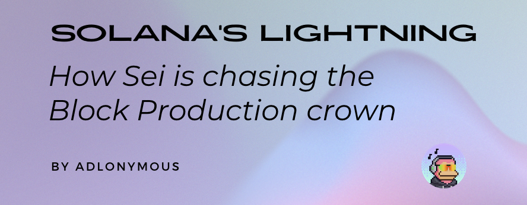

Thanks to Brennan Watt (Anza) and Mike McCoy (Sei Development Foundation), without whose help this article wouldn't be possible.

> Note: For brevity and sticking to the topic, some concepts like chain forks, blockstore, TVU, and so on have not been covered in this article. This article also takes into consideration the architectures that are live on mainnets and not the improvements to be done in the future.

## TLDR;

Block Building is a crucial part of a transaction’s lifecycle on blockchains. It determines which transactions are included in a block and in what order. On Solana, the process begins when users submit transactions to RPC nodes, which forward them to the current leader (block producer). Within the leader’s TPU, transactions are received from the RPCs using QUIC, verified, deduplicated, executed by SVM in parallel, timestamped using PoH, organized into shreds, and propagated to other validators for validation and eventual inclusion into a block.

Sei has a similar process: Users submit transactions to RPCs, which add them to the local mempool. An elected block producer picks transactions off its mempool, constructs a block, and sends a block proposal to the rest of the network that verifies the transactions and votes on whether its valid while each validator optimistically starts to execute the block, and if a consensus is reached, the block is committed to the network.

While both blockchains are constantly evolving towards the ultimate goal of increasing bandwidth and reducing latency, through innovative architecture designs, currently Solana takes the lead as is proven by its massive adoption and performance metrics.

## Introduction

In terms of high-performance blockchain architecture, Solana continues to set the standard that newer chains like Monad, Aptos, Sui, and Sei are working overtime to match. This article explores the conceptual foundations behind Solana’s Block Production mechanism, contrasting it with Sei’s approach. We’ll examine the transaction flow from when it enters the Transaction Processing Unit (TPU), Banking Stage architecture, Proof of History (PoH) mechanism and in both the Agave and the upcoming Firedancer client and compare it with Sei’s Block Production mechanism, and how Solana remains positioned at the forefront of high-performance blockchain architecture, amid new competition.

## Solana Block Production

Solana transactions undergo quite the journey from when a user submits them to being included in a block and finalized. When you click submit on a transaction through a webpage or wallet, the transaction is routed to one of many RPC Nodes. These nodes keep track of all the information on the network but don’t vote on blocks or participate in consensus. The RPC node then forwards the transaction to a validator node designated as the leader.

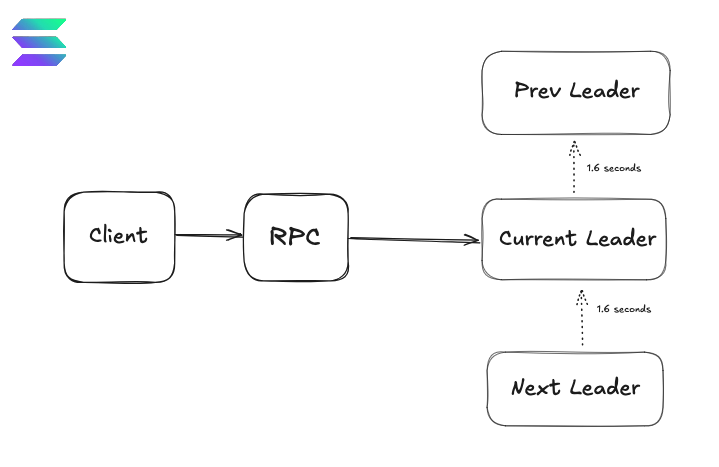

> The Solana network uses a rotating leadership model that appoints a single validator in the network to be the block-producing validator for a fixed time period of 1.6 seconds (4 slots where each slot lasts 400 milliseconds). Validators with higher amounts of stake have a higher chance of being the leader. The leader schedule is determined in advance, so it is possible to know the upcoming leaders in the network.

When the transaction is transmitted to the leader, it enters what is known as its Transaction Processing Unit (TPU). The TPU is where all the transactions to be included in a block during a slot are received, deduplicated, processed, executed, and put in a block before it is sent to other validators to verify (check if all the transactions within it are valid) and come to a consensus on whether it is a valid block to be appended to the chain.

Each Validator client on Solana has its implementation of the Transaction Processing Unit (TPU). However, the basic flow is that once it enters the leader, it gets processed through the TPU, shredded, and sent across the network using Turbine — Solana’s block propagation mechanism. The journey to high throughput begins with the TPU, which consists of different stages, each having a specialized function to carry out in parallel whenever possible. Currently, Agave is the only functioning client (except JitoSolana, a fork of Agave focused on MEV — more on this later) on the Solana Network, with new clients like Firedancer and Sig on the way.

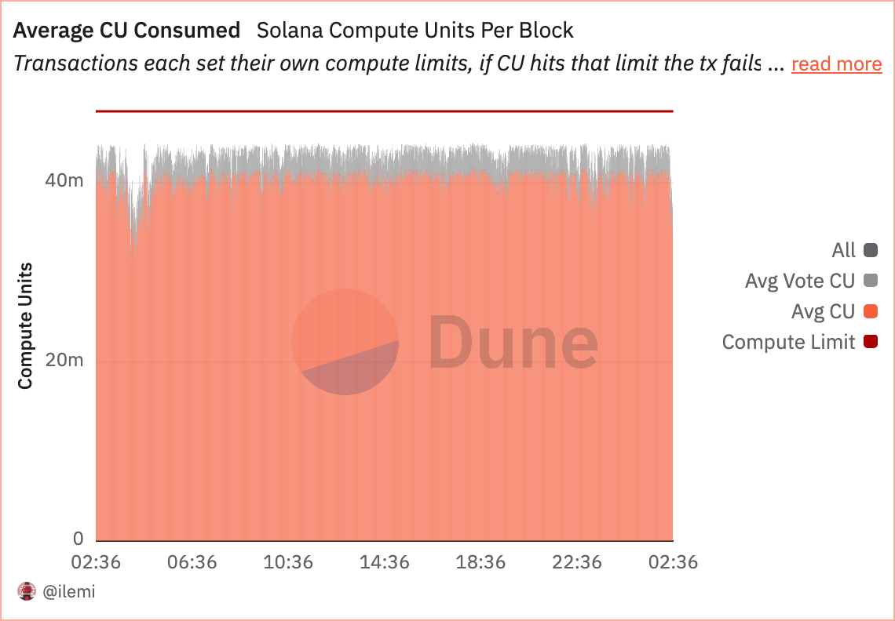

Each transaction on Solana is associated with a fixed base fee based on the number of transaction signatures and the number of CUs (Compute Units) it uses. Each transaction is allocated a maximum CU budget, and exceeding this leads to the transaction terminating. The current budget per transaction is 1.4 million CUs. In 2022, the network introduced priority fees, an optional fee to allow transactions to prioritize themselves against other transactions in the leader’s queue, resulting in faster execution times, and the price depends on the number of compute units in the transaction.

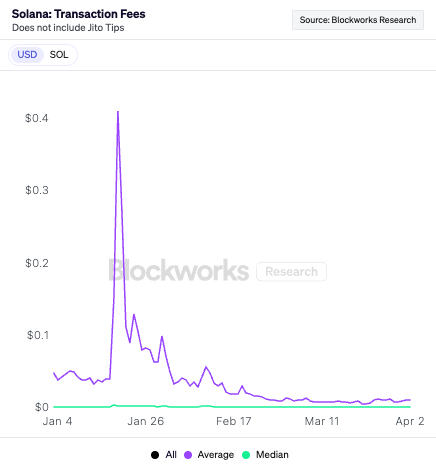

## General Implementation

The Agave client in production by Anza — a fork of the original Solana Labs client, now deprecated — is the only active validator on the Solana network, except for the JitoSolana client, which is a fork of it.

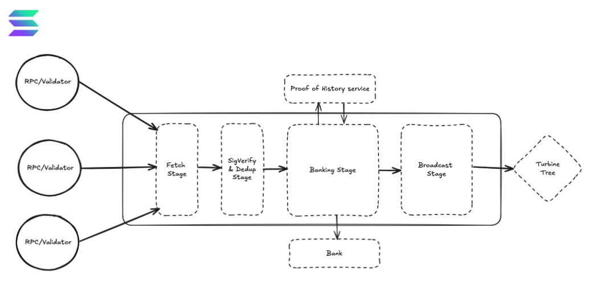

When a leader receives a transaction from an RPC, it enters the TPU, where the transaction is received using QUIC, called the Fetch Stage, where transactions received are batched into groups of 128.

> QUIC stands for Quick UDP Internet Connections and is a modern transport layer protocol for sending data through packets between devices on the same network. It allows quick delivery of data packets like UDP coupled with the integration of cryptographic key exchange and protocol details into an initial handshake similar to TCP.

The next stage is the SigVerify stage, which receives the packets from the fetch stages, verifies the transaction’s signature, checks for the correct number of signatures, handles de-duplication, and passes on to the next stage, called the Banking stage, which is arguably the most critical stage in the TPU. In this stage, the ‘block production’ truly happens and gets its name from the ‘bank, ‘ which is the chain’s state at a given block. This stage consists of the Scheduler and Execution Zone.

The primary job of the Scheduler is to package the transactions into batches of 64 non-conflicting transactions and schedule them for execution in parallel threads in the Execution Zone, where the transactions are executed by Solana’s Virtual Machine (SVM). The scheduler sorts the transactions by how much the validator wants to execute them based on the fees they will generate and the computing resources required. This aims to prioritize transactions that have a high fee but are cheap to run to maximize validator revenue. The transactions are scheduled to go into 6 threads (2 for vote transactions and 4 for normal transactions), processing transactions in parallel in such a way that conflicting transactions are executed sequentially while non-conflicting transactions are executed in parallel.

The accounts included in the transactions are then locked to make sure there aren’t any conflicts in the accounts involved in the transaction. Then, checks are run to ensure the transaction isn’t too old or has already been processed. After this, the accounts are loaded, transaction logic is executed, and the account state and data like balances, program code, or program state are updated in the Bank using a custom database system called AccountsDB.

These transactions are organized into entries, hashed, and sent to the Proof of History service for timestamping. The block’s bank is updated, and the entries are sent to the next stage, called the Broadcast stage. In this stage, the entries that form a block are packaged into shreds of a block, erasure coded, and then transmitted through a turbine tree generated in this stage to other validators in the network to replay, validate, and vote on whether or not this block should be included in the blockchain. The consensus uses the Proof of History timestamp to easily agree on the order of events, and if a consensus is reached, the block is committed to the chain.

> With the introduction of SWQoS in early 2024, if a staked node is available to the RPC, the transaction can be sent to the staked node which has its TPU that processes transactions and sends it to the Leader’s TPU forward port through the Scheduler before it can reach the Execution part of the Banking stage and subsequent stages, and the Leader includes it in the blocks it makes. But sometimes, if the staked node has an upcoming Leader slot available, it may hold on to the block execute it, and include it in the blocks it makes. Each leader allows two types of connections through QUIC — 500 open connections for any RPC node and 2000 stake-weighted connections only for staked validators.

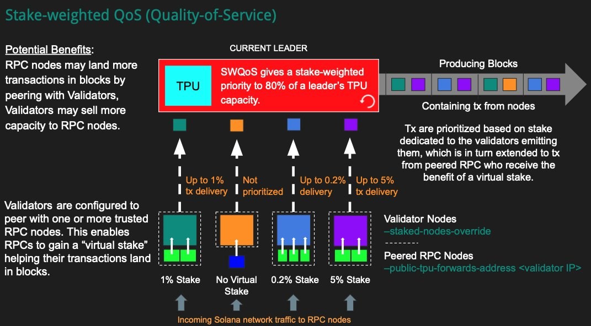

## New Implementations & MEV 

In 2022, Jump Crypto announced that they’re working on a new validator client built from the ground up in the C programming language and is currently in testing with its first block on the Solana testnet achieved in 2024. A hybrid version called Frankendancer, which combines Firedancer’s networking stack with the existing Agave client’s runtime, is already live on mainnet-beta.

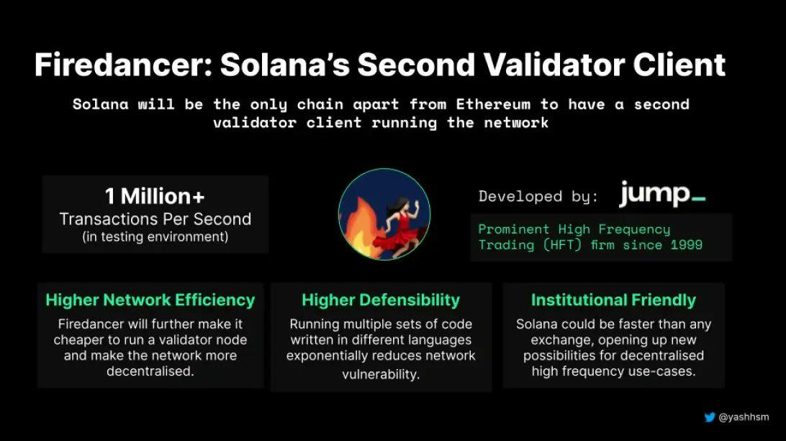

The v0 Firedancer architecture in Frankendancer contains a re-architected TPU, with the rest of the validator client software to be introduced to mainnet-beta soon. The transaction flow is similar but is rewritten with key optimizations, with most of the improvements to the TPU being low-level optimizations like managing context switches, reducing memory copying between threads, efficiently allocating CPU cores to different operations, and avoiding system calls. Another very important optimization being made is the prevention of locking on transactions, eliminating the need for a complex scheduler. More on this in a later article.

Also in 2022, Jito open-sourced the Jito-Solana client — a fork of the Agave (then Solana Labs) client with modifications to enable MEV-boosted validator activity on Solana. It was ‘intentionally designed to earn MEV profits and optimize their distribution to network validators and stakers.’ The client is the centerpiece of a suite of products from Jito aimed at maximizing validator revenue and eliminating network spam, like the Jito Block Engine & relayer, Jito bundles, ShredStream, etc.

> MEV (Maximal Extractable Value) refers to any value derived from adding, removing, or reordering the transactions within a given block. The most common types of MEV transactions on Solana are arbitrage involving price discrepancies across different DeFi platforms, liquidations on borrow/lend positions or during blue-chip NFT mints. Frontruns, backruns and sandwiching are not as common due to the absence of a mempool in the validator architecture but Jito’s MEV suite does provide the opportunity for such activity. The beneficiaries of MEV activities are called searchers.
>
> Bundles are groups of atomically executed transactions that are used for MEV activity. If any transaction fails, the rest of the transactions will not be executed and the state will revert back so the state from the first transaction never gets committed, to minimize wastage of block space. Searchers can include extra out-of-protocol fees called tips along with their bundles as an incentive for validators to include their transactions at the top of the block.

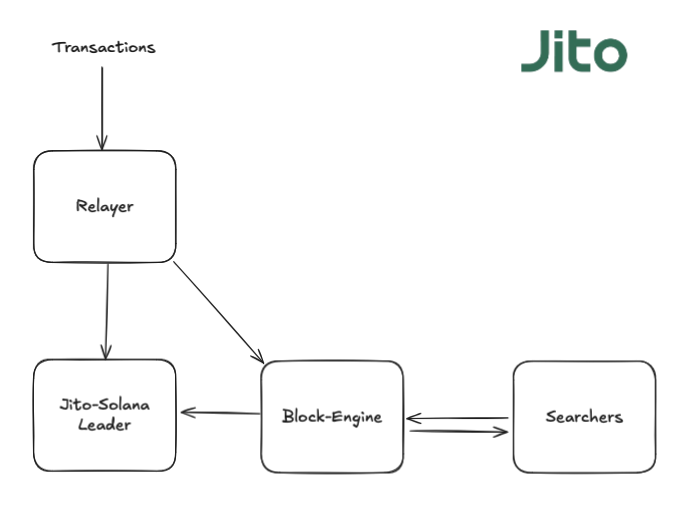

When a JitoSolana client is the leader, transactions are forwarded to the ‘Jito Relayer,’ which functions as a proxy router for transactions submitted to the validator. This effectively replaces the Fetch & Sigverify stages by incorporating QUIC, signature verification, and deduplication. The relayer sends the transactions to the ‘Jito Block Engine’ or holds the transactions for 200ms and sends them to the leader’s Relayer Stage, which receives transactions for the next steps while the Block Engine does its thing. Jito runs a few relayers, but validators can choose to run their relayer or just use other relayers since it can run on the same or separate server as the validator.

Jito allows searchers and applications to submit bundles containing time-sensitive transactions for MEV activity like arbitrage and liquidations to the Block Engine. The 200ms delay allows searchers to simulate transactions sent to the relayer and construct transaction bundles accordingly. Blockspace is pre-allocated before the processing of each bundle to ensure its completion. During the delay, an off-chain block space auction is conducted as well, and searchers compete using tips to get their bundles included in the block in their ideal position. The Block Engine then forwards these transactions to the BlockEngine Stage which receives bundles and forwards it to the next stage. The bundles and transactions are then sent to the ‘Bundle Stage’ to be processed and included in a block like in the Agave client.

## Will Sei have a say?

Sei is a high-performance EVM-based L1 blockchain built on the Cosmos SDK and Tendermint Consensus Protocol and is optimized for trading and DeFi applications. An immediate parallel to Solana’s early days can be seen as it, too, started as a trading-oriented blockchain aiming to build the decentralized NASDAQ at the speed of light. Sei aims to build the fastest parallelized EVM L1 and handle high-throughput, low-latency workloads. The transaction flow in Sei is different from Solana, as we’ll now see.

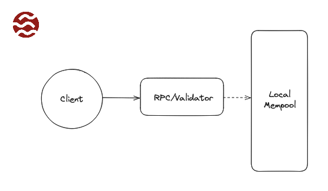

When a transaction is submitted and signed on the Sei network, they are routed to the nearest RPC node (runs full validator software unlike on Solana) which performs a series of lightweight validation checks like checking the validity of the signature, the fee sufficiency, transaction format compliance, deduplication, and estimating gas usage. If these checks are successful, the transactions are sent to the node’s local mempool (an in-memory pool of unconfirmed transactions awaiting inclusion in a block), which is prioritized based on the fee involved or time submitted. Then, this mempool is propagated across the network using a gossip protocol, such that all validators sees the same view of the mempool. From the active validator set, a validator is chosen as the block-proposer based on stake weight in a round-robin fashion.

The chosen proposer then gathers transactions from its mempool to include in the block. There is typically a block size limit (depending on the amount of gas — which is the amount of compute — that can be executed in each block), so the proposer will take as many high-priority transactions as fit during this stage which ensures the selected transaction don’t exceed block limits and add or drop transactions if needed. After this selection, the proposer assembles the block along with its metadata. Importantly, the proposer doesn’t fully execute all transactions and relies on previous validations to assume they are valid.

Once the block is assembled, the proposer broadcasts a block proposal to the network, with just references to the transaction (block header & transaction IDs) rather than the full block data. It also sends the full block by dividing it into parts and disseminating it across the network, which arrives after the block. Since the validators in the network already have the actual transactions in their mempool, they quickly identify the transactions the block contains and start processing them. Right after sending the block proposal, the proposer disseminates the whole block by splitting it into chunks. If a validator was missing a transaction, it will receive it in this broadcast. This means that by the time the full block data is available, every validator has essentially the same block assembled. The network thus achieves a rapid shared view of the proposed block.

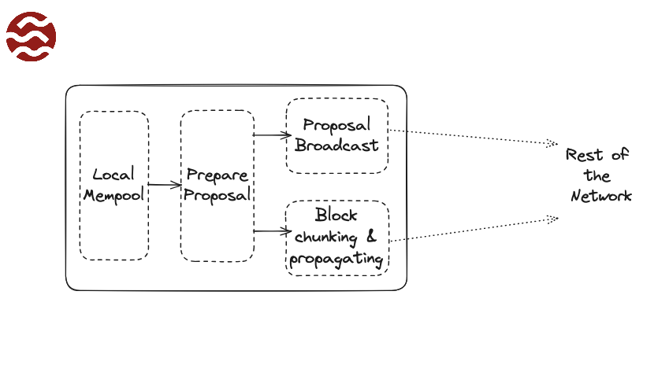

Once a validator has the proposed block, it validates the proposal before voting on it. This involves performing validations on each transaction and verifying that all the transactions in the block are valid according to the state. Then a step is carried out where the block’s transactions are run through in ‘Check mode’ to ensure none would fail if executed. In such a case, the validator would broadcast a ‘prevote’ for a nil block, causing the consensus to move on and the bad block to be dropped. Assuming the block is valid, the validator now enters the Tendermint consensus voting stages — it sends a prevote for this block to all the other validators in the network. If at least 2/3 of the voting power prevotes for the proposed block, the protocol moves to the ‘Precommit stage. ’ Validators then send precommit votes for the block, and if at last 2/3 of the voting power again precommits for the block, it is decided to be the next block of the chain.

By the time precommits are collected, the network has agreed on the block. During these voting stages, the Sei validators begin optimistically executing the transactions even before finalizing the vote. If the required majority is not met, the consensus will move to the next block and try again. Alongside votes, the block itself is finalized to all the nodes in the network. By the time the precommit stage is successful, each validator should have the full block data. At this stage, the network has reached consensus on a specific block, and next comes executing the transactions and committing the block.

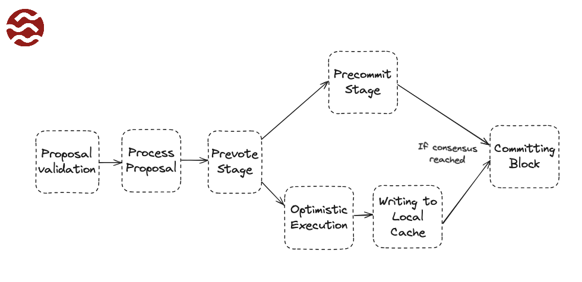

Since Sei implements optimistic block processing without waiting for the block to be officially committed, as soon as a validator receives the block proposal, it begins executing the block’s transactions and updating the state to a local data cache. If the network does not reach a consensus on the block, then the cache is cleared, and it’s on to the next block. This optimistic execution cuts down latency since very little needs to be done once consensus is reached because the validators have essentially pre-executed everything.

Once validators have all of the transactions as a part of the block proposal, they try to come to a consensus on the transaction ordering. Instead of waiting for the validators to come to a consensus, validators start optimistically processing transactions and updating the state to a data cache. This processing of transactions is parallelized (similar to Solana) to increase throughput. The validator builds a Direct Acyclic Graph (DAG) of transactions at runtime, enforcing the sequential processing of transactions operating on the same state while maintaining parallelism for others. If the block is accepted by the network, the data from the cache is committed, otherwise, the data from the cache is discarded. The block is now committed to the chain, on-chain state updated and mempools are pruned to remove confirmed or expired transactions. The chain then advances to the next block and the cycle repeats.

## Sei vs Solana

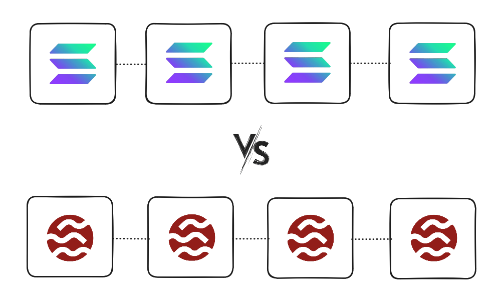

While there are quite a few parallels that can be drawn between Solana and Sei, there are some key differences, as you might have noticed from the previous sections. Here are a couple of the architectural design decisions that give the other blockchain the edge:

- Sei follows the Ethereum-esque way of using a mempool that has to be propagated across the network, introducing propagation delay and overhead. Solana’s approach cuts out the gossip lag by directly routing incoming transactions to the leader, resulting in quicker inclusion and feedback. By avoiding a large, lingering mempool, Solana drastically reduces confirmation time and memory usage and can switch leaders quickly without a backlog of transactions slowing things down. Though Sei has optimizations like broadcasting a compact block proposal, it must still deal with the consequences of a mempool-based architecture. 

- Sei inherits Tendermint’s proposer selection, where the block proposer is essentially decided block-by-block rather than in a long pre-published schedule. Solana can pipeline block production without pause, whereas Tendermint’s synchronous voting rounds inherently add latency since the number of messages grows significantly as more validators join the network. This is called ‘Quadratic Communication Complexity’ and leads to heavy traffic over the gossip protocol at high node counts. Solana’s design avoids this scaling bottleneck, allowing it to maintain 400ms slots even with hundreds or thousands of validators.

- Sei achieves deterministic finality through a single block commitment process using Tendermint-based consensus, where transactions are finalized as soon as a block receives two-thirds precommits. This guarantees that once a transaction is included, it is irreversible, eliminating the possibility of forks or chain reorganization. Solana uses an optimistic confirmation model with Tower BFT layered over Proof of History, which provides fast but probabilistic finality. While Solana’s blocks are confirmed within a second under normal conditions, finality can take several additional slots. Sei’s strict finality model offers greater predictability and simplicity for applications that require strong guarantees, like settlement layers or institutional finance systems.

## So, who's the winner?

Well, the game's not over yet! Until now, Solana is ahead of the game in terms of the most relevant metrics, as we’ve just seen. But both Solana and Sei are constantly innovating and pushing upgrades to their networks with one goal in mind — Increase Bandwidth, Reduce Latency. Solana is increasing blockspace to 50M CUs and maybe even 60M CUs soon, while Sei is working towards a new iteration of the current network in production — Sei Giga, which promises exponential performance upgrades. Who wins? Only time can tell. Until then, we’re off to the races. May the best chain win!

## References 

- **Solana Deep Dive Resources**
  - [Solana How It Works (Interactive Visualization)](https://solanahowitworks.xyz)
  - [YouTube: Solana Explained (IaElggvrYsI)](https://www.youtube.com/watch?v=IaElggvrYsI)
  - [Anza: Central Scheduler in Agave v1.18](https://www.anza.xyz/blog/introducing-the-central-scheduler-an-optional-feature-of-agave-v1-18)
  - [Helius: What’s New in Solana v1.18](https://www.helius.dev/blog/all-you-need-to-know-about-solanas-v1-18-update)
  - [YouTube: Solana v1.18 Explained (owLlIRXQvo8)](https://www.youtube.com/watch?v=owLlIRXQvo8)
  - [Dune Dashboard: Solana Metrics by ilemi](https://dune.com/ilemi)
  - [Blockworks Analytics: Solana Onchain Activity](https://blockworks.co/analytics/solana/sol-onchain-activity)

- **Sei Network and Cosmos Insights**
  - [Zerocap: Sei Network & Cosmos Chain Optimization](https://zerocap.com/insights/research-lab/sei-network-cosmos-chain-optimisation/)
  - [Sei Protocol GitHub RFCs](https://github.com/sei-protocol/sei-chain/tree/main/docs/rfc)
  - [Sei Protocol Whitepaper (PDF)](https://github.com/sei-protocol/sei-chain/blob/main/whitepaper/Sei_Whitepaper.pdf)
  - [Sei Blog: Sei v2 - The First Parallelized EVM](https://blog.sei.io/sei-v2-the-first-parallelized-evm/)
  - [Sei Blog: Twin Turbo Consensus](https://blog.sei.io/twin-turbo-consensus)

- **Cosmos Ecosystem Background**
  - [Cosmos Official Docs](https://docs.cosmos.network/main/learn/)

- **Critical Takes & Broader Perspectives**
  - [Cyber Capital: "So Long Solana?"](https://www.cyber.capital/news/so-long-solana-the-rise-of-blockchains-parallel-universes)

- **Validator Monitoring**
  - [Validators.app](https://www.validators.app/) — Explore validator performance and network health across chains.

- [Stake Weighted Quality of Service](https://www.helius.dev/blog/stake-weighted-quality-of-service-everything-you-need-to-know#the-lifecycle-of-a-transaction-with-swqos)
- [All You Need to Know About Solana and QUIC](https://www.helius.dev/blog/all-you-need-to-know-about-solana-and-quic)

